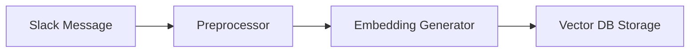
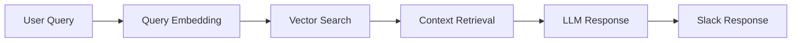

# RAG System Design for Slack App

## Core Components Needed

1. **Vector Database Service**
   - Pinecone integration
   - Document/message storage and retrieval
   - Vector index management

2. **Text Processing Service**
   - Message preprocessing
   - Embedding generation
   - Chunking strategy for messages

3. **RAG Query Service**
   - Context retrieval
   - Query processing
   - Response generation via LLM

4. **Chat History Management**
   - Conversation state tracking
   - Context window management
   - Message threading

## Data Flow

1. **Message Ingestion Flow**


2. **Query Flow**


## System Architecture Considerations

### 1. Isolation Strategy
- Create separate services for:
  - Vector DB operations
  - Text processing
  - RAG operations
  - Chat management
- Use clear interfaces between components
- Implement dependency injection for better testing

### 2. Data Storage Requirements
- Vector database for embeddings
- Message metadata storage
- Conversation history storage
- Configuration management

### 3. Performance Considerations
- Batch processing for message ingestion
- Caching strategy for frequent queries
- Async processing where possible
- Rate limiting for external APIs

## Implementation Order

1. **Phase 1: Core Infrastructure**
   - Set up Pinecone client
   - Create embedding generation service
   - Implement basic message processing

2. **Phase 2: RAG Implementation**
   - Build context retrieval system
   - Implement query processing
   - Set up LLM integration

3. **Phase 3: Chat Features**
   - Implement conversation management
   - Add threading support
   - Create chat history tracking

4. **Phase 4: Integration**
   - Connect with existing Slack app
   - Add error handling
   - Implement monitoring and logging

## Key Problems to Solve

1. **Message Processing**
   - How to chunk messages effectively
   - Handling different message types
   - Dealing with code snippets and formatting

2. **Context Management**
   - Determining relevant context window
   - Balancing context quality vs. quantity
   - Handling conversation history

3. **Performance**
   - Managing API costs
   - Optimizing response times
   - Handling concurrent requests

4. **User Experience**
   - Command interface design
   - Response formatting
   - Error handling and feedback

Would you like me to elaborate on any of these components or move forward with implementing a specific part?

---

# MVP Slack Context-Aware Assistant Tasks

## 1. Core Infrastructure Setup
- [ ] Set up Pinecone vector database
- [ ] Configure OpenAI/LLM API access
- [ ] Basic Slack app configuration for message access

## 2. Message Processing (MVP)
- [ ] Capture new messages from specified channels
- [ ] Generate embeddings for messages
- [ ] Store messages and metadata in Pinecone
```python
class BasicMessageProcessor:
    def process(self, message):
        embedding = generate_embedding(message.text)
        store_in_pinecone(embedding, {
            'text': message.text,
            'timestamp': message.ts,
            'channel': message.channel
        })
```

## 3. Search/Retrieval System
- [ ] Implement basic similarity search
- [ ] Create simple context window management
- [ ] Build basic query-to-response pipeline

## 4. Basic Command Interface
- [ ] Implement `/ask` command
- [ ] Add simple query parsing
- [ ] Create basic error handling

## 5. Response Generation
- [ ] Set up basic LLM prompt template
- [ ] Implement context-aware response generation
- [ ] Format responses for Slack

## Testing & Deployment
- [ ] Basic integration testing
- [ ] Deploy MVP version
- [ ] Monitor for critical issues

This simplified approach focuses on getting a working prototype that can:
1. Store messages as vectors
2. Retrieve relevant context when queried
3. Generate helpful responses using that context

Would you like me to elaborate on any of these core components?
